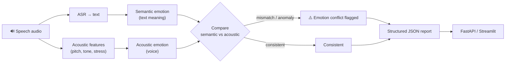

# AcoSemantic-TR

<p>
  
  
  
  
  
  
</p>

> **Acoustic–semantic emotion analysis for Turkish speech.** Detects emotion mismatches and
> anomalies by jointly evaluating textual meaning and acoustic features (tone, stress), exposing a
> production-ready analysis layer with reusable JSON output (FastAPI + Streamlit).

## Overview

AcoSemantic-TR is an analysis service that detects emotional discordance and anomalies in
Turkish speech by jointly evaluating the **meaning of the words** and the **acoustic features
of the voice** (tone, stress).

The goal is an end-to-end, production-ready analysis layer that returns reusable JSON output.

**New (v1.1):** The acoustic side no longer depends on a single model — a **model-free,
from-scratch prosodic feature extractor** (pitch/F0, energy, speaking rate, pauses) was added.
This means the acoustic analysis genuinely measures "tone/stress", and the system keeps working
**even without the acoustic model** (prosody fallback). An evaluation module also **calibrates
the thresholds with real data**.

## Architecture



## Quick Start

1. Create and activate a virtual environment (e.g. venv).
2. Install dependencies:

```bash
pip install -r requirements.txt
```

3. Set your Hugging Face token (see Token Management).

## Token Management

Model access requires `HF_TOKEN` or `HUGGINGFACE_HUB_TOKEN`. Do **not** commit this token to the
repo; set it temporarily in PowerShell or place it in a local, gitignored `.streamlit/secrets.toml`:

```toml
HF_TOKEN = "your_hugging_face_token"
HUGGINGFACE_HUB_TOKEN = "your_hugging_face_token"
```

PowerShell example:

```powershell
$env:HF_TOKEN = "your_hugging_face_token"
$env:HUGGINGFACE_HUB_TOKEN = $env:HF_TOKEN
streamlit run app.py
```

## How to Run

Start the API:

```bash
uvicorn api:app --reload
```

Health check:

```bash
curl http://127.0.0.1:8000/health
```

Analyze a file (curl):

```bash
curl -X POST "http://127.0.0.1:8000/analyze" \
  -F "file=@demo_samples/ornek.wav" \
  -F "asr_model=Whisper Small" \
  -F "sentiment_model=Savasy Turkish Sentiment" \
  -F "acoustic_model=DynAnn Speech Emotion"
```

Run the Streamlit UI:

```bash
streamlit run app.py
```

## 🧪 Tests & Code Quality

The decision logic (`src/decision.py`) is isolated from audio I/O and the models, so it is pure,
fast and **testable without heavy dependencies**.

```bash
ruff check .     # lint (required in CI)
pytest -q        # unit tests (~0.1 s, no torch/librosa needed)
```

- **CI** — GitHub Actions runs `ruff` + `pytest` on every push/PR
- **Tests** cover all branches of the decision engine (masking anomaly, boundary cases,
  injectable thresholds) and config integrity

---

## 🎚️ Prosodic Analysis (model-free) & Evaluation

**`src/prosody.py`** — interpretable prosodic features extracted from the raw waveform with pure NumPy DSP:

| Feature | What it measures |
|---------|------------------|
| `pitch_mean_hz` / `pitch_std_hz` | Autocorrelation-based F0 and **pitch variability** (arousal/stress) |
| `rms_mean` / `rms_std` | Loudness and its variability |
| `zcr_mean` | Zero-crossing rate (speech-rate / noisiness proxy) |
| `pause_ratio` / `voiced_ratio` | Silence / pause ratio |
| `stress_index` (0–1) | A **composite prosodic stress score** derived from the above |

These are added to every analysis; if the acoustic model cannot be loaded, `stress_index` is used
as a **fallback**.

**`src/evaluation.py`** — delivers the "calibrate the thresholds with real data" goal:
`precision / recall / F1 / accuracy` metrics plus `calibrate_thresholds(...)`, which **grid-searches
the decision thresholds to maximize F1**. Works with labelled data such as RAVDESS.

```python
from src.evaluation import calibrate_thresholds
# samples: (positivity, stress, is_discordant) ...
best = calibrate_thresholds(samples)
print(best.positive_threshold, best.stress_threshold, best.metrics["f1"])
```

## Project Structure (Key Files)

- `api.py` — FastAPI endpoints
- `app.py` — Streamlit interface
- `src/analysis.py` — end-to-end analysis flow (including prosody + fallback)
- `src/decision.py` — emotion-discordance decision engine (pure, testable)
- `src/prosody.py` — model-free prosodic feature extraction (NumPy DSP)
- `src/evaluation.py` — metrics + threshold calibration
- `src/models.py` — model loading and inference
- `demo_samples/` — sample audio and demo outputs

## Default Models & Thresholds

- ASR: `openai/whisper-small` (default)
- Sentiment: `savasy/bert-base-turkish-sentiment-cased` (default)
- Acoustic: `dynann/emotion-speech-recognition` (default)
- Decision thresholds (default, validate with data): text_positivity > 0.50, voice_stress > 0.30

## Docker (Quick)

For a production-like single-service run:

```bash
docker build -t acosemantic-tr-api .
docker run --rm -p 8000:8000 --env-file .env acosemantic-tr-api
```

## Notes & Tips

- If the acoustic model fails to load, the pipeline degrades gracefully to the model-free
  prosodic stress score (see v1.1 above) instead of failing.
- If you drop test audio into `demo_samples/`, the interface lists it automatically.

## Roadmap

1. ✅ Threshold calibration is now data-driven via `src/evaluation.py` (F1 grid-search).
2. Run smoke tests and the core unit tests.
3. Run formatters and a linter (Black, isort, ruff/flake8).
4. Verify production `.env` and secret management.

## License

Released under the [MIT License](LICENSE).
