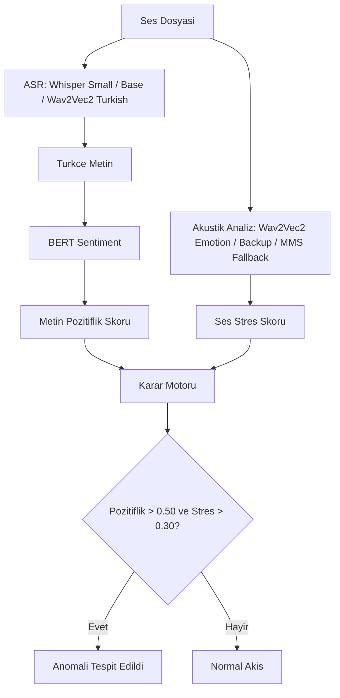

# AcoSemantic-TR

Turkce konusmada metin anlami ile ses tonunu ayni anda inceleyen bir "maskeli duygu" demo projesi. Sistem, konusmayi yaziya cevirir, Turkce sentiment ile metin pozitifligini olcer, akustik modelle stres ipuclari cikarir ve iki sinyali birlikte yorumlayarak celiskili durumlari isaretler.

## Ozellikler

- Ses dosyasindan otomatik konusma metni cikarma
- Turkce metin duygu analizi
- Akustik stres tahmini ve heuristik fallback
- Mel-spektrogram goruntuleme
- Streamlit tabanli tek sayfa arayuz

## Kisa Bilgi

- ASR: `openai/whisper-small`
- Sentiment: `savasy/bert-base-turkish-sentiment-cased`
- Akustik: `dynann/emotion-speech-recognition`
- Karar esikleri: `Metin_Pozitiflik > 0.50` ve `Ses_Stres > 0.30`

## Kurulum

1. Python 3.10 veya uzeri kurulu olsun.
2. Bagimliliklari yukleyin:

```bash
pip install -r requirements.txt
```

3. Nvidia GPU varsa CUDA destekli PyTorch surumunu kullanin. Yoksa CPU surumu ile devam edebilirsiniz.

## Calistirma

```bash
streamlit run app.py
```

## Demo Akisi

Arayuzde iki kaynak vardir:

- `Yuklenen dosya`: Harici ses dosyasini yukleyip analiz edersiniz.
- `Demo klasoru`: `demo_samples/` icindeki hazir orneklerden birini secip tek tikla calistirirsiniz.

Eger elinizde RAVDESS veya EMO-DB uzerinden alinan sesler varsa bunlari `demo_samples/` klasorune koyun. Arayuz otomatik algilar.

## Model Notlari

- Varsayilan ASR modeli olarak `openai/whisper-small` kullanilir.
- Turkce sentiment tarafinda `savasy/bert-base-turkish-sentiment-cased` tercih edilir; model bulunamazsa heuristik fallback devreye girer.
- Akustik tarafta `dynann/emotion-speech-recognition` onceliklidir; gerekirse yedek modeller denenir.
- Model yuklenemezse sistem tamamen durmaz, akustik ve metin icin heuristik yaklasimlarla calismaya devam eder.

## Karar Mekanizmasi

```text
Eger Metin_Pozitiflik > 0.50 ve Ses_Stres > 0.30 ise:
    Celiski_Skoru = (Metin_Pozitiflik + Ses_Stres) / 2
    "Anomali Tespit Edildi"
```

## Sistem Mimarisi



## Demo Dosyalari

`demo_samples/` klasorune RAVDESS veya EMO-DB uzerinden en az 3 celiskili ornek wav dosyasi koyun. Iyi test kombinasyonlari:

- Sakin kelimeler + yuksek stres tonu
- Mutlu kelimeler + sinirli ton
- Nötr kelimeler + baskili ve kontrollu ton

Klasor icindeki ornekler arayuzde otomatik listelenir.
