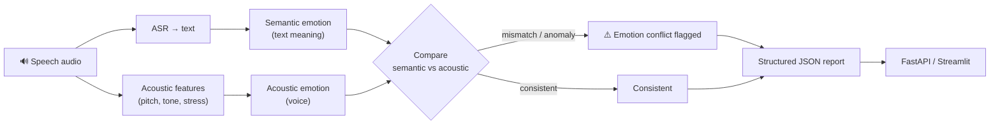

# AcoSemantic-TR

<p>
  
  
  
  
  
</p>

> **Acoustic–semantic emotion analysis for Turkish speech.** Detects emotion mismatches and
> anomalies by jointly evaluating textual meaning and acoustic features (tone, stress), exposing a
> production-ready analysis layer with reusable JSON output (FastAPI + Streamlit). *Docs in Turkish.*

## AcoSemantic-TR — Kısa Tanım

AcoSemantic-TR, Türkçe konuşmalarda metin anlamı ile sesin akustik özelliklerini (ton, stres) birlikte değerlendirerek duygu çelişkilerini ve anomalileri tespit eden bir analiz servisidir.

Hedef: Uçtan uca çalışan, tekrar kullanılabilir JSON çıktısı veren ve üretime alınmaya uygun bir analiz katmanı sunmak.

## Mimari (Architecture)



## Hızlı Başlangıç

1. Sanal ortam oluşturun ve etkinleştirin (ör. venv).
2. Bağımlılıkları yükleyin:

```bash
pip install -r requirements.txt
```

3. Hugging Face token'ınızı ayarlayın (bakınız Token Yönetimi).

## Token Yönetimi

Model erişimi için `HF_TOKEN` veya `HUGGINGFACE_HUB_TOKEN` gereklidir. Bu token'ı repoya eklemeyin; geçici olarak PowerShell'de ayarlayabilir veya yerel, .gitignored `.streamlit/secrets.toml` içine koyabilirsiniz:

```toml
HF_TOKEN = "your_hugging_face_token"
HUGGINGFACE_HUB_TOKEN = "your_hugging_face_token"
```

PowerShell örneği:

```powershell
$env:HF_TOKEN = "your_hugging_face_token"
$env:HUGGINGFACE_HUB_TOKEN = $env:HF_TOKEN
streamlit run app.py
```

## Nasıl Çalıştırılır

API başlatmak için:

```bash
uvicorn api:app --reload
```

Sağlık kontrolü:

```bash
curl http://127.0.0.1:8000/health
```

Dosya ile analiz örneği (curl):

```bash
curl -X POST "http://127.0.0.1:8000/analyze" \
  -F "file=@demo_samples/ornek.wav" \
  -F "asr_model=Whisper Small" \
  -F "sentiment_model=Savasy Turkish Sentiment" \
  -F "acoustic_model=DynAnn Speech Emotion"
```

Streamlit UI çalıştırmak için:

```bash
streamlit run app.py
```

## Klasör Yapısı (Önemli Dosyalar)

- `api.py` — FastAPI endpoint'leri
- `app.py` — Streamlit arayüzü
- `src/analysis.py` — Analiz ve karar mantığı
- `src/models.py` — Model yükleme ve çıkarım
- `demo_samples/` — Örnek sesler ve demo çıktıları

## Varsayılan Modeller ve Eşikler

- ASR: `openai/whisper-small` (varsayılan)
- Sentiment: `savasy/bert-base-turkish-sentiment-cased` (varsayılan)
- Akustik: `dynann/emotion-speech-recognition` (varsayılan)
- Karar eşikleri (varsayılan, veriyle doğrulanmalı): Metin_Pozitiflik > 0.50, Ses_Stres > 0.30

## Docker (Hızlı)

Üretim benzeri tek servis çalıştırma için:

```bash
docker build -t acosemantic-tr-api .
docker run --rm -p 8000:8000 --env-file .env acosemantic-tr-api
```

## Notlar ve İpuçları

- Model yükleme başarısız olursa uygulama doğrudan hata verir — bu proje model tabanlı çalışmayı zorunlu kılar.
- `demo_samples/` klasörüne test sesleri konulursa arayüz otomatik listeler.

## Geliştirme ve Yayına Hazırlık

1. Eşikleri gerçek veriyle yeniden kalibre edin.
2. Smoke testleri ve temel birim testlerini çalıştırın.
3. Kod formatlayıcı ve linter (Black, isort, ruff/flake8) çalıştırın.
4. Üretim `.env` ve secret yönetimini doğrulayın.

---

İhtiyorsanız README'yi daha kısa bir kullanıcı rehberi veya dağıtım talimatına da indirebilirim.
