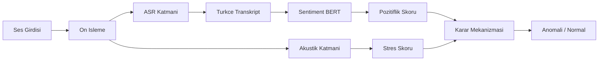

# Sistem Mimarisi

## Bilesenler

- ASR: Whisper Small ana model, Whisper Base ve Wav2Vec2 Turkish yedek
- Akustik: Wav2Vec2 emotion modelleri ana yol, MMS encoder heuristik yedek
- NLP: Turkce BERT sentiment sinifi
- UI: Streamlit + mel-spektrogram gorunumu

## Sunum Mesaji

Sistem, yalnizca metni degil, tonlamayi da analiz ederek duygu maskelemesini tespit eder. Bu nedenle klasik sentiment siniflayicidan daha zengin bir sinyal birlesimi sunar.
